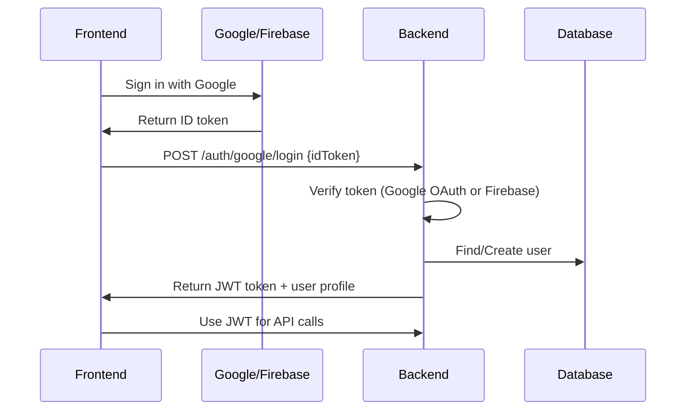
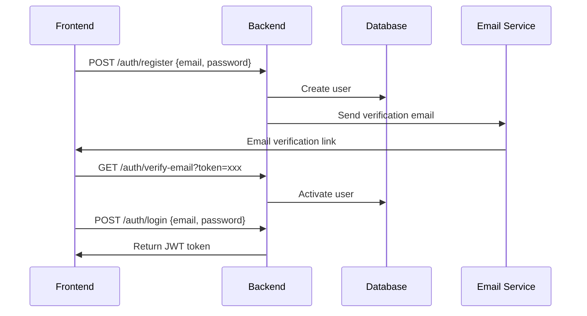

# Authentication Setup Guide

This guide covers the setup and configuration of authentication methods in SplitBuddy Backend.

## 🔐 Authentication Methods

SplitBuddy Backend supports multiple authentication methods:

1. **Traditional Email/Password Authentication**
2. **Google OAuth Authentication**
3. **Firebase Authentication**

## 📧 Email/Password Authentication

### Setup

Email/password authentication is enabled by default and requires:

- **SMTP Configuration** for email verification and password reset
- **JWT Secret** for token generation

### Environment Variables

```bash
# JWT Configuration
JWT_SECRET=your-secure-jwt-secret

# SMTP Configuration (for email verification)
SMTP_HOST=smtp.gmail.com
SMTP_PORT=587
SMTP_USER=your-email@gmail.com
SMTP_PASS=your-app-password
SMTP_FROM=your-email@gmail.com
```

### Endpoints

- `POST /api/v1/auth/register` - User registration
- `POST /api/v1/auth/login` - User login
- `POST /api/v1/auth/request-email-verification` - Request email verification
- `GET /api/v1/auth/verify-email` - Verify email with token
- `POST /api/v1/auth/request-password-reset` - Request password reset
- `POST /api/v1/auth/reset-password` - Reset password

## 🔑 Google OAuth Authentication

### Setup

Google OAuth authentication requires configuration in Google Cloud Console.

### 1. Google Cloud Console Setup

1. Go to [Google Cloud Console](https://console.cloud.google.com/)
2. Create a new project or select existing project
3. Enable the Google+ API
4. Go to "Credentials" → "Create Credentials" → "OAuth 2.0 Client IDs"
5. Configure OAuth consent screen
6. Create Web Application credentials
7. Add authorized redirect URIs:
   - `http://localhost:5900/api/v1/auth/google/callback` (development)
   - `https://yourdomain.com/api/v1/auth/google/callback` (production)

### 2. Environment Variables

```bash
# Google OAuth Configuration
GOOGLE_CLIENT_ID=your-google-client-id
GOOGLE_CLIENT_SECRET=your-google-client-secret
GOOGLE_CALLBACK_URL=http://localhost:5900/api/v1/auth/google/callback
GOOGLE_ANDROID_CLIENT_ID=your-android-client-id  # Optional
```

### 3. Endpoints

- `POST /api/v1/auth/google/login` - Google OAuth login
- `POST /api/v1/auth/google/signup` - Google OAuth signup
- `POST /api/v1/auth/google/verify` - Verify Google token

## 🔥 Firebase Authentication

### Setup

Firebase Authentication is supported through Firebase ID tokens. The backend automatically detects and validates Firebase tokens.

### 1. Firebase Console Setup

1. Go to [Firebase Console](https://console.firebase.google.com/)
2. Create a new project or select existing project
3. Enable Authentication
4. Add Google as a sign-in provider
5. Configure your web app
6. Get your Firebase configuration

### 2. Frontend Integration

Your frontend should use Firebase Authentication SDK:

```javascript
// Initialize Firebase
import { initializeApp } from 'firebase/app';
import { getAuth, signInWithPopup, GoogleAuthProvider } from 'firebase/auth';

const firebaseConfig = {
  // Your Firebase config
};

const app = initializeApp(firebaseConfig);
const auth = getAuth(app);

// Google Sign-In
const signInWithGoogle = async () => {
  const provider = new GoogleAuthProvider();
  const result = await signInWithPopup(auth, provider);
  const idToken = await result.user.getIdToken();

  // Send token to backend
  const response = await fetch('/api/v1/auth/google/login', {
    method: 'POST',
    headers: { 'Content-Type': 'application/json' },
    body: JSON.stringify({ idToken }),
  });

  return response.json();
};
```

### 3. Backend Integration

The backend automatically handles Firebase tokens:

1. **Token Detection**: Backend tries Google OAuth verification first
2. **Fallback**: If Google OAuth fails, tries Firebase token verification
3. **User Creation**: Creates or updates user profile
4. **JWT Response**: Returns backend JWT token for API access

### 4. Environment Variables

Firebase authentication uses the same Google OAuth environment variables:

```bash
GOOGLE_CLIENT_ID=your-google-client-id
GOOGLE_CLIENT_SECRET=your-google-client-secret
GOOGLE_CALLBACK_URL=http://localhost:5900/api/v1/auth/google/callback
GOOGLE_ANDROID_CLIENT_ID=your-android-client-id  # Optional
```

## 🔄 Authentication Flow

### Google OAuth/Firebase Flow



### Email/Password Flow



## 🛡️ Security Considerations

### CORS Configuration

The backend is configured to handle CORS for OAuth flows:

```typescript
// Security headers for OAuth
res.removeHeader('Cross-Origin-Opener-Policy');
res.setHeader('Cross-Origin-Embedder-Policy', 'unsafe-none');
res.setHeader('Cross-Origin-Resource-Policy', 'cross-origin');
```

### Token Validation

- **Google OAuth**: Validates tokens using Google's OAuth2Client
- **Firebase**: Decodes and validates JWT tokens
- **JWT**: Uses configurable secret for backend tokens

### Environment Variables

Never commit sensitive configuration:

```bash
# ✅ Good - Use environment variables
GOOGLE_CLIENT_ID=your-actual-client-id

# ❌ Bad - Don't hardcode
GOOGLE_CLIENT_ID=123456789-abcdef.apps.googleusercontent.com
```

## 🧪 Testing Authentication

### Test Endpoints

```bash
# Test environment configuration
curl http://localhost:5900/api/v1/env-test

# Test database connection
curl http://localhost:5900/api/v1/db-test

# Test Google OAuth endpoint (with invalid token)
curl -X POST http://localhost:5900/api/v1/auth/google/login \
  -H "Content-Type: application/json" \
  -d '{"idToken": "test-token"}'
```

### Expected Responses

#### Environment Test

```json
{
  "success": true,
  "data": {
    "google": {
      "clientId": "***",
      "clientSecret": "***",
      "callbackUrl": "http://localhost:5900/api/v1/auth/google/callback",
      "androidClientId": "***"
    }
  }
}
```

#### Authentication Error (Expected for test token)

```json
{
  "success": true,
  "data": {
    "message": "Google authentication failed",
    "error": "Unauthorized",
    "statusCode": 401
  }
}
```

## 🔧 Troubleshooting

### Common Issues

1. **CORS Errors**: Check CORS configuration and origins
2. **Token Validation Fails**: Verify Google OAuth credentials
3. **Firebase Token Issues**: Ensure Firebase project is properly configured
4. **Email Not Sending**: Check SMTP configuration

### Debug Steps

1. Check environment configuration: `curl /api/v1/env-test`
2. Verify Google OAuth credentials in Google Cloud Console
3. Check Firebase project configuration
4. Review backend logs for detailed error messages
5. Test CORS preflight requests

### Log Messages

The backend provides detailed logging:

```
✅ Google OAuth verification successful
⚠️ Google OAuth verification failed, trying Firebase token...
✅ Firebase token verification successful
❌ Google/Firebase authentication failed: [error details]
```

## 📚 Additional Resources

- [Google OAuth 2.0 Documentation](https://developers.google.com/identity/protocols/oauth2)
- [Firebase Authentication Documentation](https://firebase.google.com/docs/auth)
- [NestJS Authentication Guide](https://docs.nestjs.com/security/authentication)
- [JWT.io](https://jwt.io/) - JWT token decoder and validator
